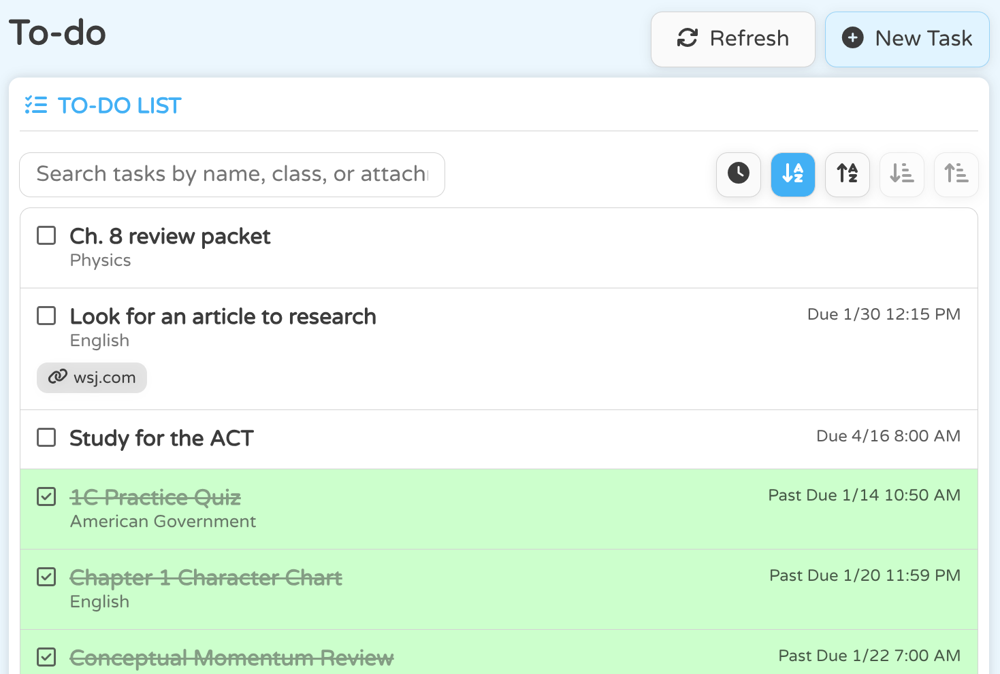
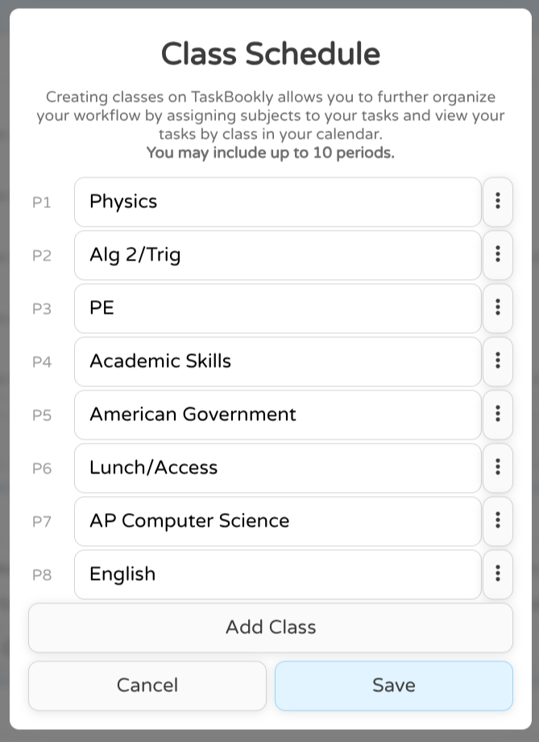

# TaskBookly v0.3.0-beta is here!
It's that time again! We're excited to announce the release of v0.3.0-beta. This is a large update, so let's get to it!

# <i class="fa-solid fa-check-double"></i>To-do Lists
This update introduces the brand new tasklist and the To-do tab, you can now track all your tasks from your classes and assign deadlines and priorities along with links to those tasks! Tasks can also be sorted alphabatically and by deadline. Your tasks are also saved to your TaskBookly account, so you can access them from any device, anywhere, at any time!

> **<i class="fa-solid fa-circle-info iCustom"></i> 
TIP:** Use filter tags such as `[done]`, `[incomplete]`, or `[external]` in the search bar to filter down tasks based on tags provided!

Any tasks that are due within a week's time will also be shown under the **Due soon** section in the **Overview** tab.

Lastly, new keybinds have been added to TaskBookly:
- Press **<kbd>ALT</kbd> <kbd>T</kbd>** to create task (can be used anywhere)
- Press **<kbd>ALT</kbd> <kbd>R</kbd>** to refresh your tasks

# <i class="fa-solid fa-clock"></i>Class Schedules
This update also introduces the class schedule! You can add up to 10 classes to your schedule and they will display when selecting a class for a task and in the TaskBookly Planner that's coming later this year.
You can find this feature under `Settings > Account > Class Schedule > Edit`.

# <i class="fa-solid fa-wrench"></i>Other changes

## <i class="fa-solid fa-stopwatch"></i>Pomodoro timer updates
The old navigation system has also been reworked so the delete button is no longer within the edit menu but instead in a new dropdown menu. Along with that change, you can now start a pomodoro timer from a specific period!

It's also now possible to assign a task from your to-do list to organize what you need to accomplish and split up your work periods into seperate 'segments.'

<video muted autoplay loop>
    <source src="media/timerSFH.mp4" type="video/mp4">
</video>

## <i class="fa-solid fa-plug-circle-bolt"></i>New Google API (BETA)
This update also introduces a new Google API integration that allows you to connect your Google account to your TaskBookly account. Doing this will mirror your Google Classroom assignments from classroom onto your TaskBookly To-do list so you can see everything in one place without having to manually create them.

Please note this is still a work in progress feature and bugs may be present. Your classroom data is not saved on our servers and is loaded along with your tasks.

To try out this feature, navigate to `Settings > Connections > Connect with Google`. You will be prompted to login to your Google account and grant TaskBookly access to your Google Classroom data. Once you have done this, you can navigate to your to-do list and see your Google Classroom assignments. Google classroom tasks will be marked with a <i class="fa-solid fa-plug iCustom"></i> on the right side of the task. Turning in classroom assignments, hiding specific assignments, and linking your Google Classroom classes to your TaskBookly class schedule are coming sometime in the very near future.

## <i class="fa-solid fa-trash"></i>Account termination
If necessary, you can now delete your account from the settings page. This will delete all of your data from our servers and you will no longer be able to access your account. This is a permanent action and cannot be undone (obviously). Doing this will make us sad though :(.

## <i class="fa-solid fa-drum"></i>And finally...
- <i class="fa-solid fa-lock"></i>Improved backend security
- <i class="fa-solid fa-cookie-bite"></i>Persistent cookie improvements
- <i class="fa-solid fa-bars-progress"></i>Redone loading screen (With cool fun facts!)
- <i class="fa-solid fa-keyboard"></i>New keybinds
- <i class="fa-solid fa-bug-slash"></i>Bugs smashed
- <i class="fa-solid fa-bolt"></i>Performance improvements
- <i class="fa-solid fa-paintbrush"></i>UI improvements

 

Enjoy the update, and stay focused! 
-CodeDevelops